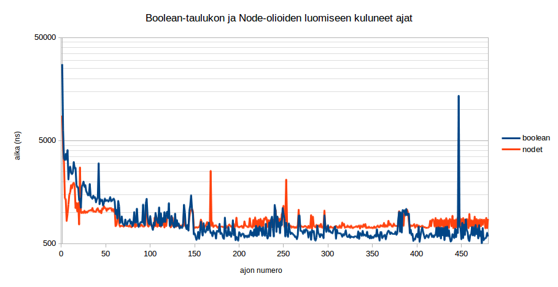
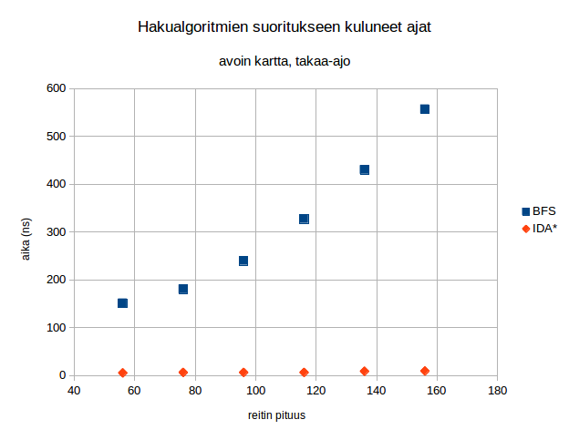
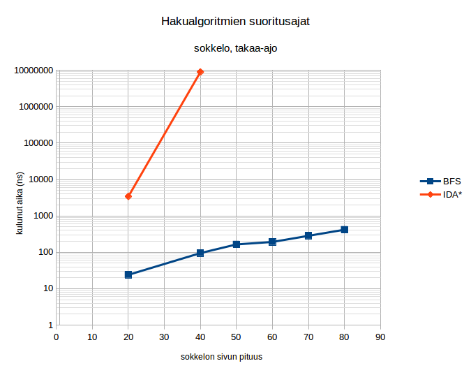

# Testausdokumentti
## Ohjelman toiminnan testauksen laajuus ja toteutus
Ohjelman kaikkien luokkien toiminta mainia lukuunottamatta on testattu pit-mutaatiotestausta käyttäen. Rivikattavuus on hyvin lähellä sataa, ainoastaan vain staattisia metodeja sisältävistä aiheutuu muutamia "testaamattomia" rivejä sillä pit tulkitsee tällöin luokkien määrittelyrivit testaamattomiksi. Mutaatiokattavuus puolestaan on 100%. Myös pit-raportti kokonaisuudessaan on nähtävissä (dokumentaatio/pit).

### LuolaLukija
LuolaLukijan toimivuus testattiin sekä toimivilla että eri tavoin toimimattomilla, joskin pienillä syötteillä. Toimivana luolana käytettiin sisällöltään seuraavanlaista tiedostoa:
<pre>
# kommentti
2 4

1 0 1 1
1 1 1 0
</pre>
Tämän tiedoston tuottaman luolan oikeellisuus testattiin vertaamalla sitä manuaalisesti luotuun kovakoodattuun taulukkoon.

Huonot syötteet testattiin seuraavantyyppisillä luolilla:
* Tiedostossa vähemmän rivejä kuin header lupaa
* Tiedostossa vähemmän sarakkeita kuin header lupaa
* Tiedostossa enemmän rivejä kuin header lupaa
* Tiedostossa enemmän sarakkeita kuin header lupaa
* Tiedosto sisältää arvoja, jotka eivät ole lukuja eivätkä kommenttirivejä
* Tiedostoa ei ole olemassa
* Header ei sisällä kahta kokonaislukua
* Headerin sisältöä ei voida parsia kokonaisluvuiksi

### Node
Node-luokan kaikille julkisille metodeille on omat testinsä. Naapurien lisäämisen toiminta testataan varmistamalla, että vastaluodulla nodella ei ole yhtään naapuria mutta yhden naapurin lisäämisen jälkeen naapureita on yksi.

Koordinaattien getterit testataan yksinkertaisesti vertaamalla niiden palauttamia arvoja Nodea luotaessa annettuihin arvoihin. Metodin getKustannusNodeenAsti toiminta testataan luomalla kolmen noden ketju ja tarkastamalla kaikkien niiden palauttamat arvot. Kokonaiskustannuksen testaaminen suoritetaan samoin, mutta nyt ketju on vain kahden solmun mittainen ja lisäksi luodaan maalisolmu, johon kustannusta lasketaan.

Metodi yritaAsettaaEdeltaja testattiin luomalla neljä neliötä vierekkäin siten, että ne muodostavat neliön. Asetetaan neliön origoa lähin kulma ("vasen yläkulma") lähtönodeksi (nollataan sen g-funktion arvo eli solmuun pääsemiseksi vaadittava kustannus) ja yritetään lisätä se kummankin sen vieressä olevan solmun ("vasen alakulma" ja "oikea yläkulma") edeltäjäksi. Kummassakin tapauksessa metodin pitäisi palauttaa true, sillä edeltäjättömän noden tulee aina ottaa tarjottu edeltäjä. Yritetään samoin asettaa vielä edeltäjättömälle "oikean alakulman" nodelle edeltäjäksi vasemman alakulman naapurisolmu, minkä pitäisi myös onnistua. Nyt kun yritetään vielä asettaa oikean yläkulman nodelle udeksi edeltäjäksi oikean alakulman node, tulisi metodin palauttaa false, sillä yhden mittaista edeltäjäketjua ei kannata korvata kahdenmittaisella.

Lisäksi testasin equals-metodin toimintaa luomalla kolme nodea, joista kahdella oli samat koordinaatit ja varmistamalla, että nille kahdelle equals palauttaa true, mutta eri koordinaateille kutsuttuna false. Lopuksi testasin, että equals kutsuttuna nodelle ja jonkin muun luokan oliolle palauttaa false. Lisäksi testasin, että hashcodet ovat samat, mikäli nodet ovat samat. En kuitenkaan testannut hashCodejen törmäyksien yleisyyttä tai muutenkaan tapauksia, joissa hashcodet saattavat poiketa toisistaan.

### NaapuriLista

NaapuriListasta tarkastetaan, että vastaluotu lista on tyhjä. Lisäksi varmistetaan, että kun listalle lisätään uusi alkio, listan pituus kasvaa, mutta jo listalla olevan alkion lisääminen uudestaan ei kasvata listan pituutta.

### NodeGeneraattori
NodeGeneraattorin testaamiseen käytän seuraavaa luolaa:
<pre>
# kommentti
7 4

1 0 1 1
1 1 1 0
0 1 1 1
1 0 1 0
1 0 1 1
0 0 1 1
1 1 1 0
</pre>
Tämän luolan suunnittelin sellaiseksi, että siinä on eristyksissä olevia nodeja (joita varsinaisen pelin luolastosta ei mitä suurimmalla todennäköisyydellä tosin tule löytymään), sekä nodeja joilla on yksi, kaksi, kolme tai neljä naapuria. 

Luodusta luolasta testaan luolan oikean koon, kulmissa olevian nodejen naapurimäärät sekä naapurimäärät yhdeltä kunkin odotetun naapurimäärän nodelta. Lisäksi tarkastan, ettei kulkukelvottomasta ruudusta ole luotu Node-oliota. Naapurien oikeellisuuden testaan testaamalla, että nodeilla, jotka ovat toistensa ainoat naapurit, naapurin naapurin hakeminen palauttaa alkuperäisen noden.

### JonoAlkio
JonoAlkiosta testataam seuraajan asettamisen ja hakemisen toiminnan tarkastamalla ensin, että vastaluodun JonoAlkion seuraaja on null, sen jälkeen asettamalla sille seuraajan ja varmistamalla, että getSeuraaja palauttaa äsken asetetun noden. Lisäksi testasin, että getNode-metodi palauttaa saman noden kuin JonoAlkiolle on sitä luotaessa annettu.

### Jono
Jonosta testataan, että alkion lisäämisen jälkeen jono ei enää ole tyhjä ja että jonoon lisätyt alkiot palautetaan samassa järjestyksessä kuin ne on jonoon laitettu. Samoin testataan, että juuri luodun jonon onTyhjä-metodi palauttaa true, yhden alkion lisäämisen jälkeen false ja kun kaikki alkiot on poimittu jälleen true. Lisäksi varmistetaan, että tyhjälle jonolle kutsuttaessa poimiNode-metodi palauttaa null.

### PrioriteettijonoAlkio
PrioriteettijonoAlkion testaus muistuttaa hyvin paljon JonoAlkion testausta. Jo JonoAlkiossa esiteltyjen testitapausten lisäksi testataam, että alkiot palauttavat oikean kustannuksen (alkion edustamaan nodeen pääsemiseksi vaadittu kustannus + heuristiikka)

### Prioriteettijono
Prioriteettijonosta testataan, että kun jonoon laitetaan yksi node ja sitten poimitaan se, saadaan takaisin sama node kuin jonoon laitettiin. Jonon tyhjyyden tarkastaminen on toteutettu samoin kuin tavallisella jonolla.

Lisäksi tarkastetaan, että kun jonoon laitetaan useita nodeja satunnaisessa, palauttaa poimiNode-metodi niitä sellaisessa järjestyksessä, että seuraavan noden kokonaiskustannus-metodi palauttaa vähintään yhtä suuren luvun kuin edellisen. Erikseen testataan, että jonon ensimmäisen alkion vaihtaminen toimii lisäämällä tyhjään jonoon ensin yksi alkio ja sen jälkeen toinen, jonka kustannus on pienempi. Lisäksi testataan lisäämällä jonoon sama alkio useita kertoja ja varmistamalla, että jono on tyhjä yhden poiston jälkeen, että jono ei tallenna duplikaatteja. Samaa testataan vielä lisäämällä jonoon vaihtelevassa järjestyksessä kahta eri nodea vaihtelevassa järjestyksessä, poimimalla node kahdesti ja tarkastamalla jonon tyhjyys.

### AStar
AStar-luokasta testataan, että mikäli polku lähtösolmusta maaliin on olemassa, search-metodi palauttaa polun, kun sellainen on pelialueelta löydettävissä. Tästä polusta tarkastetaan, että se on yhtä pitkä kuin todellinen lyhyin reitti, alkusolmu ja loppusolmu ovat oikeat ja näiden väliltä löytyy oikea solmu oikeasta paikasta. Kaikkien solmujen oikeellisuutta ei vertailla, sillä osa reitin solmuista ei ole yksikäsitteisiä, sillä yhtä lyhyitä reittejä on useita testiluolastossa.

Lisäksi testataan, että kun polkua lähtösolmun ja maalisolmun välillä ei ole, palautetaan null.

### Leveyshaku
Leveyshaun toimintaa testataan vastaavasti kuin A\*-haun. Niissä tapauksissa, joissa polku on olemassa, tutkitaan, ettei palautettu null, polun pituus on oikea, se alkaa ja päättyy oikeaan nodeen ja polun keskeltä valitaan jokin yksikäsitteinen alkio tutkittavaksi.

Oikean polun löytäminen testataan sekä tapauksessa, jossa jahdattava saadaan kiinni "triviaalisti" että tapauksessa, jossa jahtaajan täytyy jäädä "odottamaan" etteivät jahtaaja ja jahdattava kulkisi ristiin. Lisäksi testataan tapas, jossa jahtaaja ja jahdattava lähtevät vierekkäisistä ruuduista takaa-ajoasemasta sekä tapaus, jossa jahtaaja ei selvästi ehdi saada jahdattavaa kiinni.

### PolkuGeneraattori
Polkugeneraattoria testattaessa testataan että nodeista, joista muodostuu hämäysnodeilla höystetty polku, generoidaan oikeanmittainen ja oikeat nodet sisältävä polku annetusta maalinodesta ensimmäiseen (eli edeltäjättömään) nodeen asti.

## Suorituskykytestaus
Testasin ohjelman suorituskykyä kahdenlaisilla kartoilla: täysin avoimilla sekä "labyrinttimaisilla" pääosin yhdestä muutamaan ruutua leveistä käytävistä koostuvilla kartoilla. Avoimen kartan testit suoritin kaikki vakiokokoisella 80x80 kartalla, jossa ainoastaan asemoin jahdattavan, jahtaajan ja maalin sellaisiin paikkoihin, joista polun pituus ja todellisuudessa hakuun käytettävä alue ovat halutunkokoisia. Labyrinttimaisia karttoja loin useita eri kokoluokissa välillä 20x20 - 80x80. Nämä ovat tyypillisesti (mahdollisesti cropattuja) monikertoja allaolevasta labyrintista. Jotkin edellyttivät pieniä muutoksia, mikäli labyrintin reunojen poistaminen olisi muuten tuottanut laajoja epäyhtenäisiä alueita.
<pre>
    #                 #             # # # # # # # # # #
    #   #     # #     #             # # # #       #   # #       #     #     #
        #         #     #           # # # #       #     # #       # #     #
# # # # # # #     #     # # #   #       # # #     #                         #
            #     #             #         # # #       # # # # # # # #     #
  #     # # #     #         # # #           # # # #         #       #       #
  #     #         #             #               # # # #     #     # #       #
  #             # # # #     #     #                 # # #   #     #     #   #
  #   # # # # # #           # #   #                         #         # # #
            #                   # # # # #     # #           #     #     #     #
# # #     #   # # # # # #                 #   # #       # # # #   #           #
        #           #   #                 #     # #   # # # # # # # # #   #   #
        #         #     #     # # # # #   #       # # # #   #   # # # # # #
  #   #           #     #     #           #       # #                 # #
  # #         #   #           #           #       #                 # # # #
        # #   #         #     #     # # # # # # # #         #         # # # #
# #   #     # #         #             # # #     # #         # #         # # # #
    #         # # #   # # # # # #     # # #     # #         # #         # # # #
                    #           #     # # #     # #         # #         # # #
                    #           #     # # #                   #         # #
          # # # #   #     #     #       #                               # #
          #         # # # #     # # #   #     # # # #                 #
# # #   # #     #               #           #         #             # #
                #   #     #           #   #             #         # #   #
  # #     # # #           #     #     #   #               #       #     #
#     # #       #   #       #   #     #                   #       #       # #
                    #         #   #     # #             #       # # #     # #
    #   # # # # # # # # # # #       #   #   #         #     # # # # #     #
    #                       #           #     #     #       #
    #         # #           #   #   # # # #     # #       # # # # #     # # # #
    #         # #         # #   #         #       #                 # #
    #         # #       #       #     #           #   # #   # #     # #
    #         # #     #               #           # #           #         # # #
    #         # #   #       #         # # # #   # #             # #         # #
              # # #       #   # # # # #             #               #       # #
              # #       #           #                 #     # # #     #
# # # #       # #     #           #       # # # # #     #       #
              # #   #             #                 #           # # # # # #
    # # # # #       #     # #   #             # #       #       #     # # #
    #           #         # #         # # # #     #     #     #       # # #                     
</pre>

Suorituskykytestaus teoteutettiin omassa suorituskykytestaus-luokassa, jossa on erikseen metodit leveyshaun ja IDA\*-haun testaamiseen. Kumpikin näistä ajaa annetun haun annetussa tiedostossa sijaitsevalla kartalla ja jahtaajan, jahdattavan ja maalin sijainneilla. Kuhunkin ohjelman suoritusvaiheeseen (boolean-taulukon luominen luetun tiedoston perusteella, Node-olioiden luominen, jahdattavan reitin määrittäminen ja lopulta jahtaajan reitin määrittäminen) kuluva aika nanosekunteina tulostetaan erikseen.

Näiden lisäksi loin apumetodit testaaAvoimella ja testaaSokkelolla, jotka ajavat automaattisesti useita testitapauksia j tulostavat asianmukaiset headerit aikoja sisältäville riveille. Kukin yksittäinen testitapaus ajetaan 20 kertaa, jotta tilastollisen vaihtelun aiheuttamaa epätarkkuutta tuloksissa saadaan pienennettyä.

### Avoin kartta
Avoimella kartalla testasin sekä BFS- että IDA\*-hakuja tilanteissa, joissa jahtaajan polku jahdattavan luo vaihteli kymmenen askeleen portain välillä [30, 80]. Kaikissa näissä testitapauksissa käytettiin samaa 80x80 ruudun karttaa ja etsittävän reitin pituuteen vaikutettiin ainoastaan jahtaajan, jahdattavan ja maalin sijaintia muuttamalla. Täten ideaalitapauksessa kahteen ensimmäiseen suoritusvaiheeseen (boolean-taulukon lukemiseen ja Nodejen luomiseen) pitäisi kulua jokaisessa testitapauksessa yhtä kauan. Mitatut ajat eri suorituskerroilla ovat nähtävissä kuvaajassa alla.

Kuvaajasta havaitaan, että erityisesti boolean-taulukon luomiseen kuluvassa ajassa esiintyy välillä hyvin suuriakin poikkeamia (huomaa y-akselin logaritmisuus ja asteikon alkaminen arvosta 500 ns). Erityisesti ajat ensimmäisillä suorituskerroilla ovat pidempiä kuin myöhemmillä ja välillä esiintyy melko suuriakin satunnaisia fluktuaatioita. Näihin todennäköisesti vaikuttavat esimerkiksi tietojen sijainti välimuistissa sekä muut käynnissä olevat prosessit. Yksittäisten piikkien suodattamiseksi pois käytän jatkossa saman testin useiden eri ajokertojen keskilukuna mediaania, joka suodattaa keskiarvoa tehokkaammin pois yksittäiset poikkeavat arvot.

Avoimella kartalla sekä takaa-ajotilanteessa että reitin löytyessä IDA\* suoriutuu huomattavasti nopeammin kuin leveyshaku, kuten nähdään alla olevista kuvaajista. Kukin kuvaajan piste on kahdenkymmenen suorituskerran kuluneiden aikojen mediaani.

Suorituskykyeroa selittävänä tekijänä toimii IDA\*-haun kyky valita tutkittavaksi vain pieni osa tarjolla olevista naapurinodeista leveyshaun levittäytyessä tasaisesti kaikkiin suuntiin, jolloin avoimella kartalla tutkitaan väistämättä suuri määrä nodeja, jotka ovat selkeästi väärässä suunnassa.

### Sokkeloinen kartta
Sokkeloisella kartalla ajettiin vastaavat testit kuin avoimella kartalla. Nyt kuitenkin erityisesti IDA\*:n yhden reitin löytämiseen kuluva aika nousi melko nopeasti useiden sekuntien luokkaan, en ajanut IDA\*-hakua takaa-ajoasemassa suuremmilla kuin sivultaan 40 olevalla kartalla hahmojen liikkuessa sokkelon ohjaamana kartan kulmasta vastakkaiseen kulmaan ja reitin löytyessä pisimmillään 66 Noden mittaisella reitillä.

Suoritusajat ovat nähtävissä alla olevissa kuvissa. Nyt leveyssuuntaisen haun kuluttama aika kasvaa maltillisemmin, sillä sokkeloisessa labyrintissa yksittäisellä nodella on keskimäärin avointa karttaa huomattavasti vähemmän naapureita. Tälläisessä tilanteessa IDA\* puolestaan joutuu käymään uudelleen ja uudelleen läpi samoja nodeja, jolloin aikaa kuluu runsaasti.

Erityisesti ensimmäisessä kuvaajassa havaitaan, ettei aikavaativuus vaikuta kasvavan monotonisesti reitin pidentyessä. Tämä johtuu todennäköisesti tämän testin ajamisen sijoittumisesta ajanjaksolle, jossa suoritusaikojen hajonta on suurta varsinaisesta ajettavasta koodista riippumatta.

## Testien toistettavuus
Ohjelman toiminnallisuuden toteamiseen käytetään JUnit-testejä, joten ne voidaan ajaa helposti IDEn kuten Netbeansin testaustoimintoa tai vaihtoehtoisesti komentoriviltä.

Suorituskykytestauksessa käytetyt metodit löytyvät Suorituskykytestaus-luokasta, josta niitä on yksinkertaista kutsua main-metodia muokkaamalla.
